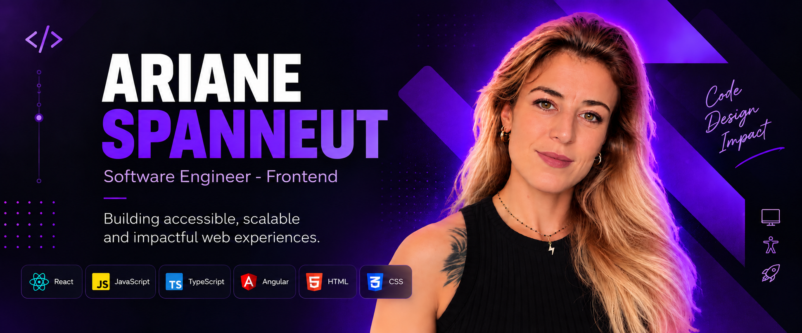
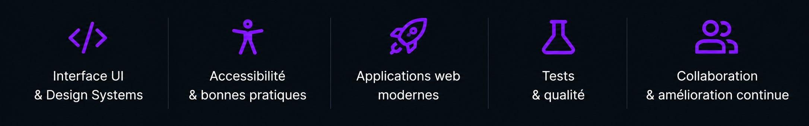
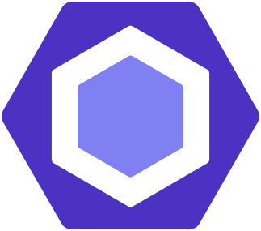
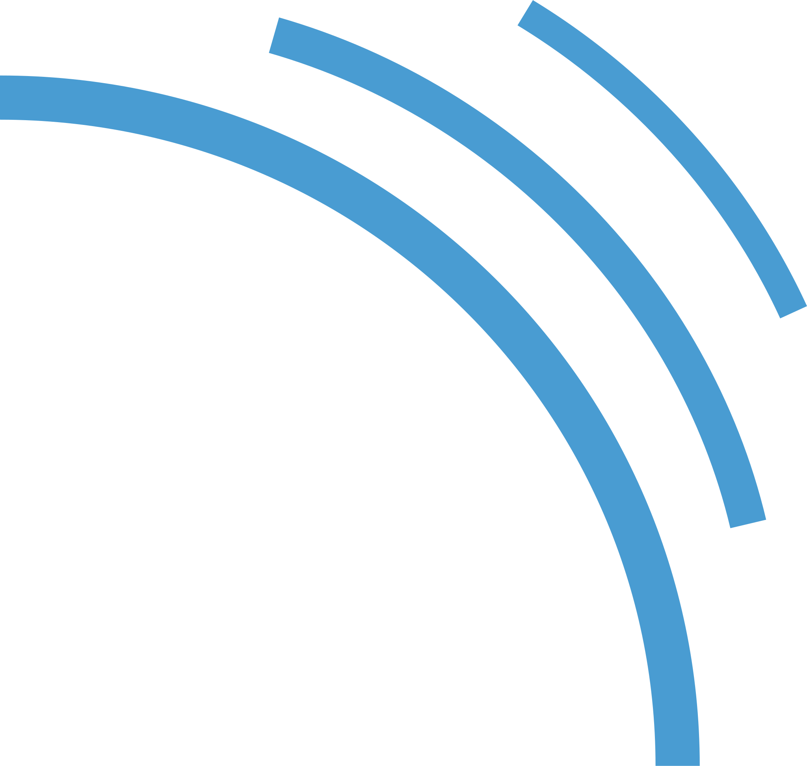

<h1 align="center">
  
</h1>

----

## À PROPOS DE MOI / ABOUT ME
 

  Développeuse frontend passionnée par la conception d'interfaces web
modernes, performantes et centrées utilisateur. J'aime transformer des idées en expériences digitales claires et
impactantes, avec une attention particulière portée à
**l'accessibilité**, la **qualité du code** et la **maintenabilité**.

 

  Frontend developer passionate about designing modern, 
high-performing, and user-centered web interfaces. I enjoy turning ideas into clear and impactful digital experiences, 
with a strong focus on **accessibility**, **code quality**, and **maintainability**.

 

  

 

---

## MES PROJETS / MY PROJECTS

 

### 🚀 RocketUI 🚀 
*React · TypeScript · Storybook · Styled Components · Testing*

 

 **Bibliothèque de composants React type-safe, accessible et testée.** Un projet dédié à la création de composants UI réutilisables et
à l'expérimentation autour des design systems modernes.

 

  **Type-safe, accessible, and tested React component library.** A project focused on building reusable UI components and exploring modern design system practices.

 

[→ Voir RocketUI / See RocketUI](https://github.com/A-Space-hub/RocketUI)

 

### 🌿 O'Feel 🌿
*React · TypeScript · Redux · React Router · Testing*

 

  **Application web de bien-être devenue mon terrain d'expérimentation frontend.** Initialement développé comme projet de fin de formation, O'Feel est aujourd'hui un bac à sable qui me permet d'expérimenter, tester et intégrer de nouvelles pratiques frontend. Le projet évolue notamment avec **RocketUI**, ma bibliothèque de composants React, et me permet de la confronter aux besoins d'une application réelle tout en explorant l'architecture, l'accessibilité, les tests et la maintenabilité.

 

  **A wellness web application turned into my frontend playground.** Originally developed as my final training project, O'Feel is now a sandbox where I can experiment with, test, and integrate new frontend practices. The project continues to evolve with **RocketUI**, my React component library, allowing me to test it against the needs of a real-world application while exploring architecture, accessibility, testing, and maintainability.

  

[→ Voir O'Feel / See O'Feel](https://github.com/A-Space-hub/ofeel-front)

 

---

## TECHNOLOGIES & OUTILS

 

### 🎨 Frontend

 

  

 
 

### 🧩 UI & State Management

 

  

 
 

### 🧪 Testing & Code Quality

 

  
  
  

 
 

### ⚙️ Backend & Databases

 

  

 
 

### 🛠️ Development Tools & Environment

 

  

 

---

## CONTACT

  **Une opportunité, un projet ou simplement envie d'échanger ?**
  
  **An opportunity, a project, or simply want to connect?**
  
   
  
  
  

---

  ### ✨ Building accessible, scalable & impactful web experiences.

